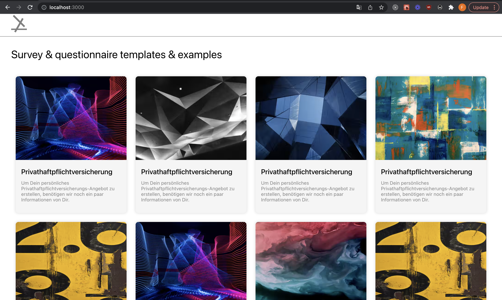

# SURVEY QUESTIONNAIRE

This project was bootstrapped with [Create React App](https://github.com/facebook/create-react-app). It is a simple app that allows a user answer questions provided by a questionnaire. The app uses the `questionnaire.json` file to derive its definition of a questionnaire

## Table of Contents

- [SURVEY QUESTIONNAIRE](#survey-questionnaire)
  - [Table of Contents](#table-of-contents)
  - [Features](#features)
  - [Concepts employed](#concepts-employed)
  - [Built with](#built-with)
  - [System Design/ UI Architecture](#system-design-ui-architecture)
  - [Designs](#designs)
  - [Required Installations](#required-installations)
  - [Installation of This Repository](#installation-of-this-repository)
  - [License](#license)
  - [Contact](#contact)

<!-- Features -->

## Features

- A user upon visiting the app, sees a list of questionnaires.
- A user on clicking a questionnaire card is redirected to the quiz-like page
- A user can go back and forth between survey pages without losing their previous selections/answers

<!-- concepts and apis employed -->

## Concepts employed

- The app is similar to what Typeform.com offers [here](https://www.typeform.com/#home-examples).
- This app demonstrates the use of basic concepts of React 
  - Components
  - Routing
  - State management (React Hooks/Context APIs)
  - Custom hooks
  - CSS Modules

<!-- BUILT wITH -->

## Built with

- HTML5
- CSS3
- Typescript
- React
  
<!-- SYSTEM DESIGN -->
## System Design/ UI Architecture

UI Implementation is done using the [Atomic Design Pattern](http://atomicdesign.bradfrost.com/chapter-2/)


<!-- DESIGNS -->

## Designs

See original survey page screenshots below;

- Questionnaire Home Page.
  

- Questionnaire Intro Page.
  

- Questionnaire/Quiz page.
  

<!-- REQUIRED INSTALLATION -->

## Required Installations

- yarn

<!-- INSTALLATION -->

## Installation of This Repository

Once you have installed the required packages shown on the [Required Installations](#required-installations), proceed with the following steps

Clone the Repository

```Shell
your@pc:~$ git clone https://github.com/fegoworks/survey-questionnaire.git
```

Move to the downloaded folder

```Shell
your@pc:~$ cd github-trending-clone
```

Install all packages

```Shell
your@pc:~$ yarn install
```

Open the app

```Shell
your@pc:~$ yarn start
```

## License

Distributed under the MIT License. See `LICENSE` for more information.

<!-- CONTACT -->

## Contact

- 🇳🇬 Edafe Oghenefego - fegoworks@hotmail.com | [Github Account](https://github.com/fegoworks) | [Twitter](https://twitter.com/@realfego) | [Linkedin](https://linkedin.com/in/oghenefego-edafe) | 

